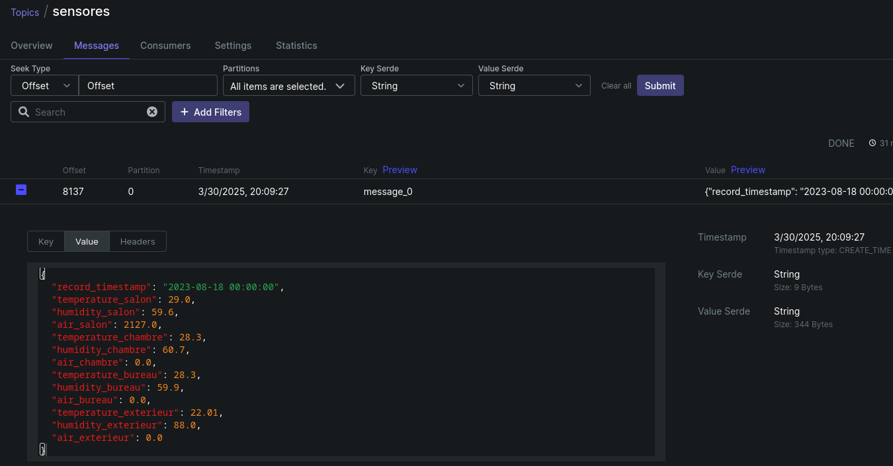
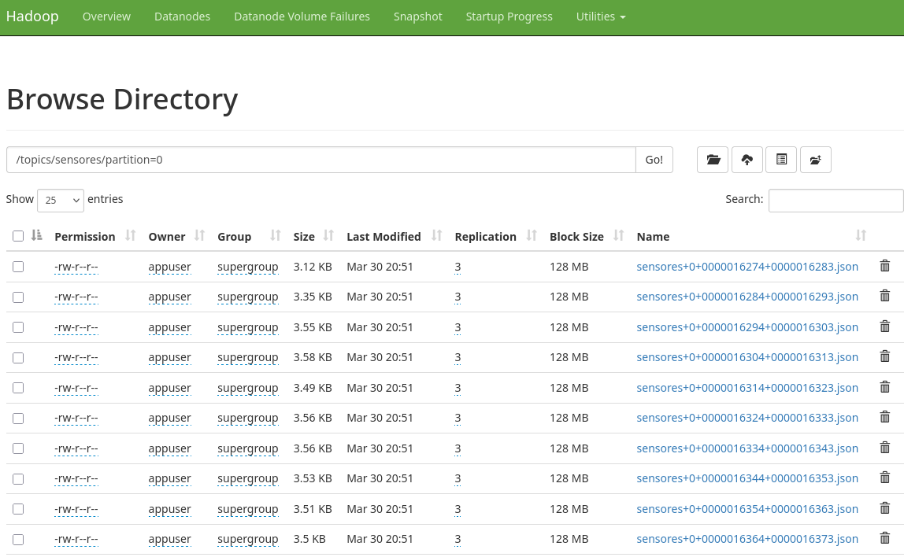
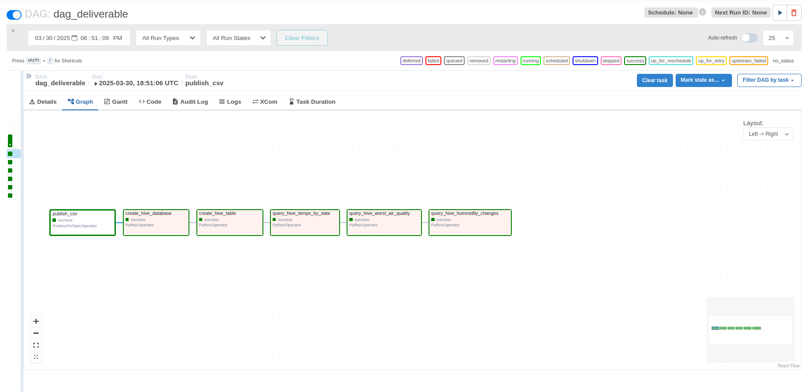
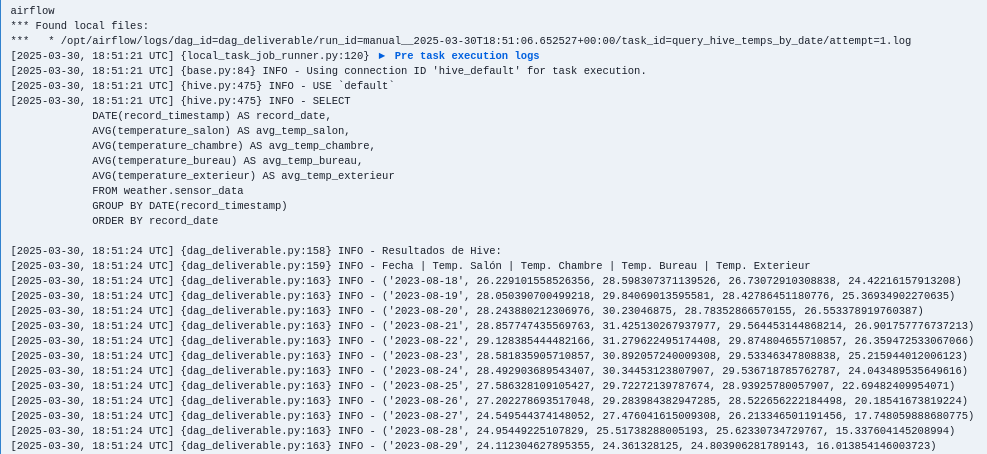

# Deliverable 3

## Creating a Kafka topic

First, we need to create a Kafka topic for the sensors, you can use the following command inside the Kafka container:
```bash
kafka-topics --create --topic transactions --partitions 1 --replication-factor 1 --bootstrap-server localhost:9092
```

Then, we need to connect the topic to HDFS. To do that, we need to create a connector. The connector is a configuration file that tells Kafka how to connect to HDFS.
```bash
curl -X POST -H "Content-Type: application/json" --data '{
  "name": "hdfs-sink-connector",
  "config": {
      "connector.class": "io.confluent.connect.hdfs.HdfsSinkConnector",
      "tasks.max": "1",
      "topics": "sensores",
      "hdfs.url": "hdfs://namenode:9000",
      "flush.size": "10",
      "hdfs.authentication.kerberos": "false",
      "format.class": "io.confluent.connect.hdfs.json.JsonFormat",
      "partitioner.class": "io.confluent.connect.storage.partitioner.DefaultPartitioner",
      "rotate.interval.ms": "60000",
      "locale": "en",
      "timezone": "UTC",
      "value.converter.schemas.enable": "false"
  }
}' http://localhost:8083/connectors
```

## Consuming data from CSV file and sending it to kafka

The code available in `src/dag_deliverable.py` starts by sending the data to the Kafka topic. It reads the CSV file and sends it to the Kafka topic using the ProduceToTopicOperator dag provider.

Sending it will automatically trigger the HDFS connector to save the data in HDFS.

## Creating a table in Hive

To create a table in Hive, we first create a database and then an external table via the following SQL statements via the HiveServer2Hook dag provider.
```sql
> CREATE DATABASE IF NOT EXISTS weather
> CREATE EXTERNAL TABLE IF NOT EXISTS {HIVE_TABLE} (
    record_timestamp DATE,
    temperature_salon FLOAT,
    humidity_salon FLOAT,
    air_salon FLOAT,
    temperature_chambre FLOAT,
    humidity_chambre FLOAT,
    air_chambre FLOAT,
    temperature_bureau FLOAT,
    humidity_bureau FLOAT,
    air_bureau FLOAT,
    temperature_exterieur FLOAT,
    humidity_exterieur FLOAT,
    air_exterieur FLOAT
  )
  ROW FORMAT SERDE 'org.apache.hive.hcatalog.data.JsonSerDe'
  STORED AS TEXTFILE
  LOCATION 'hdfs://namenode:9000{HDFS_DIR}'
```

## Querying the data

To query the data we connect to Hive the same way as before.

For the first query, we must obtain the average temperatures of each room per day.

```sql
> SELECT
    DATE(record_timestamp) AS record_date,
    AVG(temperature_salon) AS avg_temp_salon,
    AVG(temperature_chambre) AS avg_temp_chambre,
    AVG(temperature_bureau) AS avg_temp_bureau,
    AVG(temperature_exterieur) AS avg_temp_exterieur
  FROM {HIVE_TABLE}
  GROUP BY DATE(record_timestamp)
  ORDER BY record_date
```

For the second we must obtain the moments with the worst air quaility. We assumed as no information was given, that the higher the `air` value was, the worse the air quality.

```sql
> SELECT
    record_timestamp,
    air_salon,
    air_chambre,
    air_bureau,
    air_exterieur,
  GREATEST(air_salon, air_chambre, air_bureau, air_exterieur) AS max_air_quality
  FROM {HIVE_TABLE}
  ORDER BY max_air_quality DESC 
```

Finally, for the third, we must obtain the instances where humidity has changed more than 10% in an hour, for which we use tha `LAG` SQl function.

```sql
> SELECT
    record_timestamp,
    (1 - (humidity_salon/previous_humidity_salon)) AS change_salon,
    (1 - (humidity_chambre/previous_humidity_chambre)) AS change_chambre,
    (1 - (humidity_bureau/previous_humidity_bureau)) AS change_bureau,
    (1 - (humidity_exterieur/previous_humidity_exterieur)) AS change_exterieur
  FROM (
    SELECT record_timestamp, humidity_salon, humidity_chambre, humidity_bureau, humidity_exterieur,
      LAG(humidity_salon, 4, humidity_salon) OVER (ORDER BY record_timestamp) AS previous_humidity_salon,
      LAG(humidity_chambre, 4, humidity_chambre) OVER (ORDER BY record_timestamp) AS previous_humidity_chambre,
      LAG(humidity_bureau, 4, humidity_bureau) OVER (ORDER BY record_timestamp) AS previous_humidity_bureau,
      LAG(humidity_exterieur, 4, humidity_exterieur) OVER (ORDER BY record_timestamp) AS previous_humidity_exterieur
    FROM {HIVE_TABLE}
  ) AS t
  WHERE ABS(1 - (humidity_salon/previous_humidity_salon)) > 0.1
    OR ABS(1 - (humidity_chambre/previous_humidity_chambre)) > 0.1
    OR ABS(1 - (humidity_bureau/previous_humidity_bureau)) > 0.1
    OR ABS(1 - (humidity_exterieur/previous_humidity_exterieur)) > 0.1
```

## Evidences










